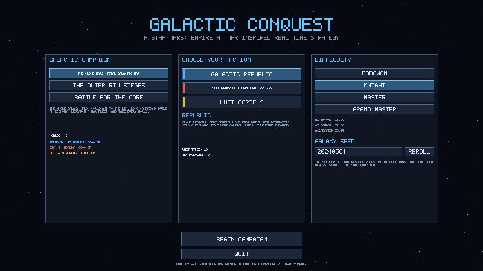
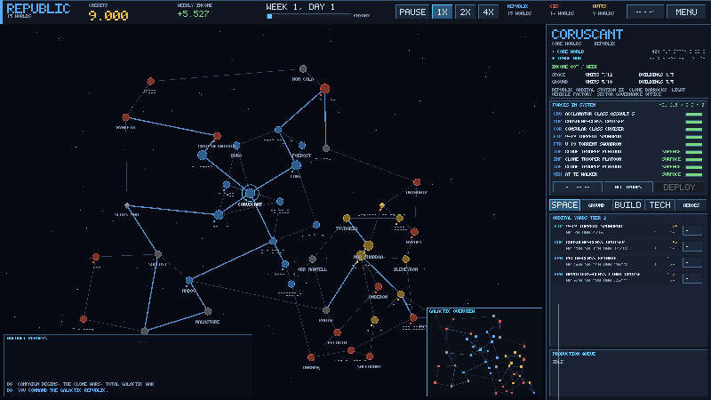
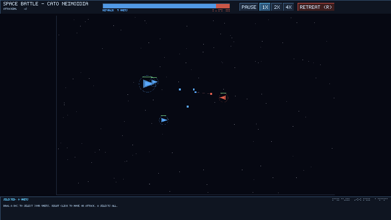
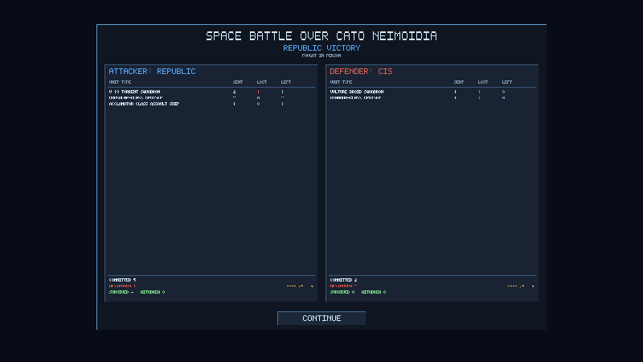

# Galactic Conquest

A Star Wars: Empire at War inspired real-time strategy game written in C++17,
set during the Clone Wars and taking a lot of its structure from the *Alliance
at War / Clone Wars* style submods: a real-time galactic conquest map with
per-planet build slots and planet bonuses, faction-specific tech trees, and
battles that can be auto-resolved or fought out in a tactical battler.

Three playable factions — the **Galactic Republic**, the **Confederacy of
Independent Systems** and the **Hutt Cartels**. Whichever you pick, the other
two are run by an AI that plays by exactly the same rules you do.

| | |
| --- | --- |
|  |  |
|  |  |

## Building

Requirements: a C++17 compiler, CMake 3.16+, and SDL2 for the graphical client.
No other dependencies — the HUD font is embedded in the binary.

```sh
# Debian/Ubuntu
sudo apt install build-essential cmake libsdl2-dev

cmake -S . -B build -DCMAKE_BUILD_TYPE=Release
cmake --build build -j
```

This produces:

| Binary | What it is |
| --- | --- |
| `build/galactic-conquest` | the graphical client (needs SDL2) |
| `build/galactic-conquest-console` | full campaign in a terminal, no dependencies |
| `build/gc_tests` | simulation test suite (`ctest --test-dir build`) |

If SDL2 is not installed, the console client and the tests still build.

## Playing

```sh
./build/galactic-conquest
```

Pick a campaign, a faction and a difficulty, then press **BEGIN CAMPAIGN**.

### Controls

| Input | Action |
| --- | --- |
| Left click a world | select it |
| Right click a world | send the selected units there |
| Mouse wheel / WASD / arrows | zoom and pan |
| Space | pause and resume |
| 1 / 2 / 3 | normal, fast and fastest speed |
| F1 | control summary |
| Esc | clear the selection |

In a tactical battle: drag a box to select, right click to move or attack, `A`
selects everything, `R` sounds the retreat, space pauses.

Useful switches: `--autostart`, `--campaign N`, `--faction N`, `--difficulty N`,
`--demo-battle`, and `--screenshot FILE.bmp` (renders a few frames, saves the
image and exits — used for smoke testing).

### Console client

```sh
./build/galactic-conquest-console                  # play in a terminal
./build/galactic-conquest-console --simulate 250   # watch the AI factions fight
```

Commands: `map`, `mine`, `info <planet>`, `build <planet> <n>`,
`struct <planet> <n>`, `tech [n]`, `move <from> <to>`, `land <planet>`,
`wait [days]`, `auto`, `log`, `help`, `quit`.

## How the game works

### The galaxy

Forty-six worlds spanning the Core, the Rim, Hutt Space and Wild Space, joined
by lanes. **Hyperlanes** — the Perlemian, the Corellian Run, the Corellian Trade
Spine — carry fleets roughly two and a half times faster than an ordinary lane,
so they shape where the fighting happens.

Every world has its own capacity, and they vary a great deal:

* **space unit slots** and **ground unit slots** cap what you can produce there
* **space build slots** and **ground build slots** cap the structures
* a **base income** paid every week

Worlds also carry traits, which is where most of the character is:

| Trait | Effect | Examples |
| --- | --- | --- |
| Orbital Shipyards | capital ships −20% cost, −30% build time | Kuat, Corellia, Fondor, Rendili, Sluis Van |
| Mining World | mining complexes may be built here | Kessel, Mygeeto, Mustafar, Vergesso |
| Forge World | vehicles −20% cost and build time | Geonosis, Sullust, Umbara |
| Cloning Facility | infantry −25% cost, −30% build time | Kamino |
| Droid Foundry | droid units −25% cost, −30% build time | Geonosis, Hypori |
| Core World / Trade Hub / Criminal Hub | large income multipliers | Coruscant, Nal Hutta |
| Fortress World | cheaper defences, defenders fight at +20% | Anaxes, Eriadu |
| Research Centre | technology −20% cheaper | Bothawui, Praesitlyn |

**Space-only systems** — Sluis Van, the Vergesso Asteroids, Rishi Station — have
no surface at all. There is nothing to invade: hold the orbit and the system is
yours.

### Time and money

The campaign runs in real time. Days tick by (six seconds each at normal speed)
and on the first day of every week the treasury is paid. A world that is
currently contested produces nothing, so a raid on a rich system hurts
immediately.

### Building things

You cannot build a unit until you have built the thing that builds it:

* **Orbital stations I/II/III** unlock ships of tier 1, 2 and 3 in orbit
* **Barracks / factories / heavy works** unlock troops of tier 1, 2 and 3
* Higher-tier structures need the matching **technology** researched first

Technology is faction-specific and follows the same idea as the AoTCW trees:
the Republic researches the *Venator Programme* to lay down Star Destroyers, the
Confederacy the *Lucrehulk Refit*, the Hutts *Black Market Warships* to buy
Separatist dreadnoughts on the quiet.

Heroes are units too. Obi-Wan, Anakin, Yoda, Grievous, Dooku, Ventress, Cad
Bane, Jabba and the rest are recruited at a planet, fight with your armies,
grant combat or income bonuses, and take time to return if they are killed.

### Taking a planet

The rules are the ones you would expect from Empire at War:

1. Move a fleet to the target. If anything hostile is in orbit — ships **or**
   armed orbital structures — a **space battle** starts.
2. You may not land while the enemy holds the orbit. Clear it first.
3. Landing troops on a defended world starts a **ground battle** against its
   garrison and ground defences.
4. The world only changes hands when you have surviving ground troops on the
   surface. (Space-only systems flip as soon as you hold their orbit.)

Faction structures are wrecked when a world changes hands; neutral
infrastructure like mines and trade ports is captured intact.

You win by holding every world in the campaign. You lose if your faction is
driven out of the galaxy entirely.

### Battles

Any battle you are involved in stops the clock and asks what you want to do:

* **Auto-resolve** — a statistical resolution that respects the same counters as
  the tactical battler: bombers hurt capital ships, anti-fighter batteries shred
  squadrons, carriers launch their wings, planetary defences and fortress worlds
  help the defender, and a badly beaten side breaks off and withdraws instead of
  dying to the last ship.
* **Fight in person** — the real-time tactical battler, in space or on the
  ground, with shields, carrier squadrons, defence structures and a retreat
  order.
* **Withdraw** — break off before a shot is fired and run for the nearest
  friendly world.

Either way you get the same after-action report: what each side committed, what
it lost, what survived, what withdrew, and the credit value of the losses,
broken down by unit type.

Retreat matters. Units that withdraw from a lost battle live to fight again at
the nearest friendly world; units still on the field when their side collapses
are destroyed. If there is no line of retreat, there is no escape.

### The AI

The AI factions are not given free units or free money beyond a difficulty
multiplier on their weekly income. They must build production structures before
they can build units, research the same technologies in the same order of
prerequisites, respect the same slot limits, and move along the same lanes.
They garrison frontier worlds, pull reserves forward from safe interior
systems, mass a strike force at a staging world, and only commit when the odds
look good. Difficulty changes their income, their combat effectiveness and how
patient they are before attacking.

## Layout

```
src/core      basic types, deterministic RNG, vector maths
src/data      the content database: units, structures, techs, planets, campaigns
src/sim       the campaign: economy, production, movement, capture, autoresolve, AI
src/battle    the real-time tactical battle simulation
src/ui        SDL2 client: bitmap font, widgets, menu, galaxy map, battler
src/app       entry points for the graphical and console clients
tests         simulation tests
```

The simulation in `src/core`, `src/data`, `src/sim` and `src/battle` has no
dependency on SDL or on any renderer, which is what lets the console client and
the tests drive the whole game headlessly.

## Tests

```sh
cmake --build build -j && ctest --test-dir build --output-on-failure
```

The suite checks data integrity (every carried squadron resolves, every faction
can build something at tier 1, space-only worlds really have no ground slots),
galaxy connectivity for all three campaigns, the economy and production rules,
slot limits, the "space before ground" capture rules, battle accounting (every
committed unit is either lost or survives), that a tactical battle always
terminates and produces a consistent report, that the AI expands while obeying
its limits, and that a given seed always produces the same campaign.

## Notes

This is an unofficial fan project. Star Wars, Empire at War and all related
names are trademarks of their respective owners; no assets from any commercial
game are used or included.
